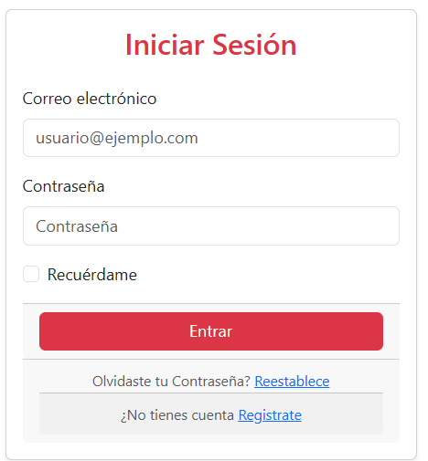
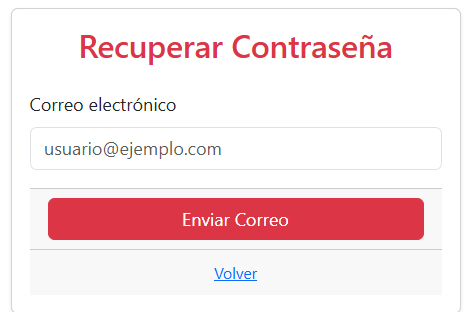
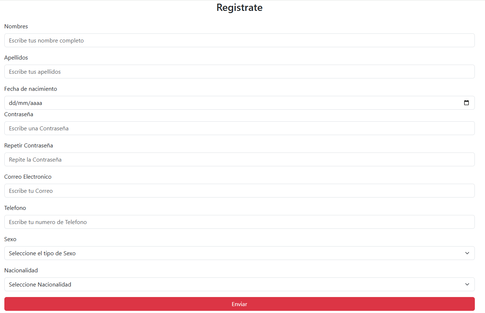

# 🛡️ Formulario de Inicio de Sesión con Bootstrap y SweetAlert2

# Finalidad del Proyecto

Este es un proyecto simple de formulario de inicio de sesión utilizando **HTML**, **Bootstrap 5** y **SweetAlert2** para mostrar alertas elegantes. Es ideal como plantilla para proyectos web básicos con diseño responsive y validaciones visuales.

## 🔧 Tecnologías utilizadas

- [Bootstrap 5.3.6](https://getbootstrap.com/)
- [SweetAlert2](https://sweetalert2.github.io/)
- HTML5
- CSS (a través de Bootstrap)
- JavaScript

## 📸 Captura de pantalla

 

  


## 📁 Estructura del proyecto

/tu-proyecto/
│
├── index.html                #Pagina principal para el inicio de Sesion
├── /html/
│ ├── Recuperar.html          #Pagina para la recuperacion de la contraseña
│ └── login.html              #Pagina para el registro de ususarios
├── /Js/
│ └── aprender.js             #Codigo JavaScript
└── README.md


## 🚀 Funcionalidades

- Diseño responsive centrado verticalmente.
- Inputs de correo y contraseña con placeholders.
- Checkbox "Recuérdame".
- Alertas elegantes con SweetAlert2 al intentar iniciar sesión.
- Enlaces para recuperación de contraseña y registro.


## 💡 Cómo probarlo

1. Clona el repositorio:

```bash
git clone https://github.com/WIMI773/Login-bootstrap.git
cd Login-bootstrap


✨ Créditos
Desarrollado por WILMAR CLAVIJO